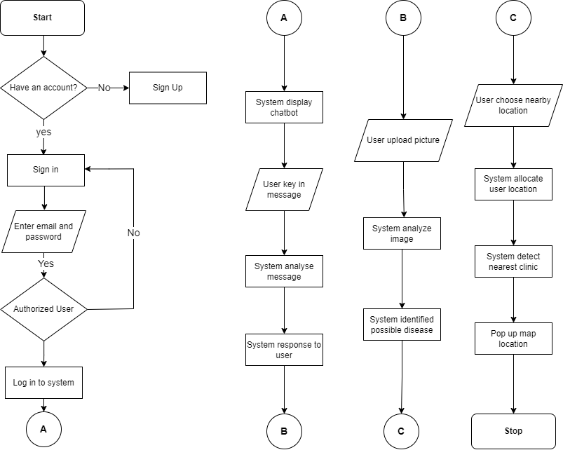
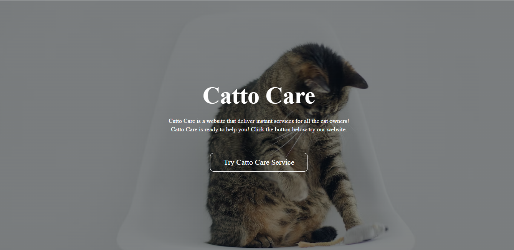
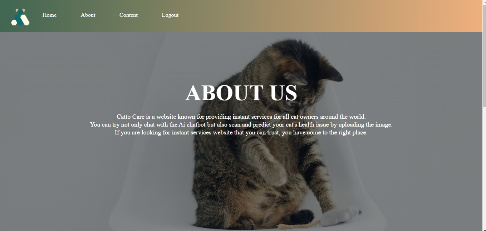
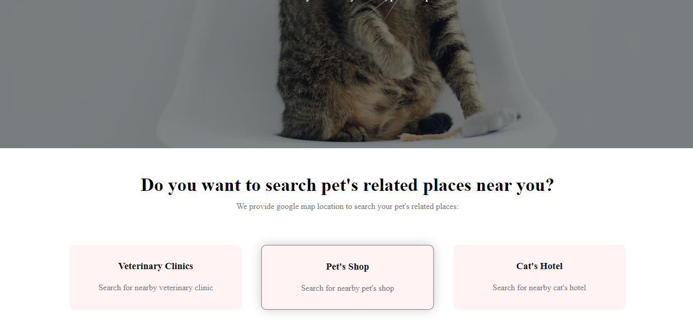
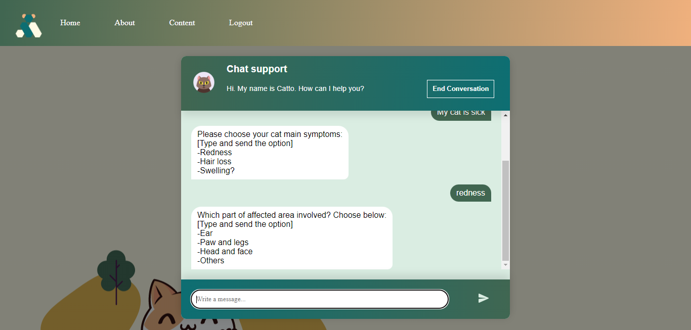

# CattoCare

# Project Title: CattoCare - A Pet Consultation Website for Cats

# Project Overview:
CattoCare is a comprehensive Pet Consultation Website designed specifically for cats. This innovative project combines machine learning, chatbot systems, image classification, and GPS location awareness to provide a holistic solution for cat owners and enthusiasts..

# Main Features:

Machine Learning Chatbot System: CattoCare incorporates a state-of-the-art chatbot system powered by machine learning. This feature allows users to receive real-time responses to their cat-related inquiries, offering guidance and assistance 24/7.

Image Classification for Disease Detection: The project utilizes image classification techniques to identify common diseases in cats based on uploaded pictures. This functionality enhances early disease detection and helps cat owners take timely action for their pet's health.

GPS Nearby Location Awareness: CattoCare provides users with awareness of nearby veterinary clinics and pet shops through GPS integration. This feature proves invaluable in emergencies, enabling users to locate essential services swiftly.
:

# Objectives:

1. Develop a user-friendly and intuitive web platform catering to cat owners.
2. Implement machine learning algorithms to create an efficient and responsive chatbot system.
3. Utilize image classification technology to accurately identify common cat diseases.
4. Integrate GPS functionality to connect users with nearby veterinary clinics and pet shops.
5. Create a comprehensive and reliable resource for cat owners to seek information and assistance related to their pets.

# The flowchart of my project

# Some of the result of the website development:

